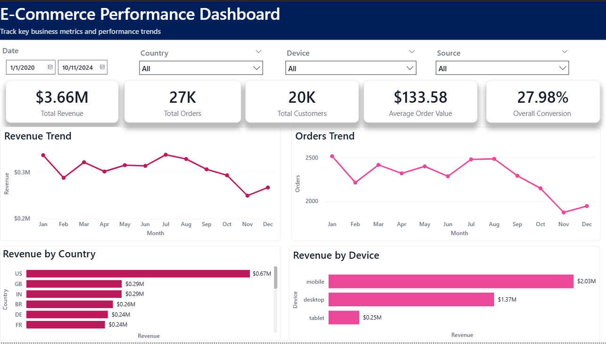
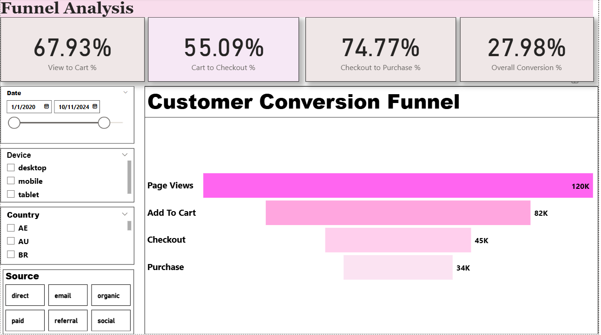
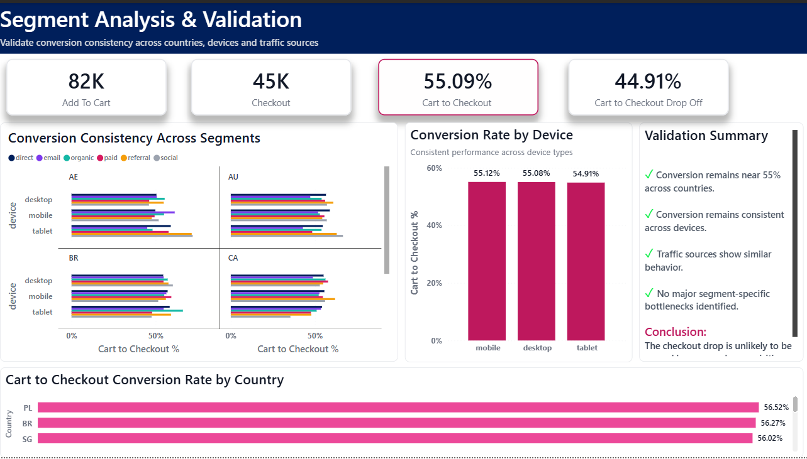
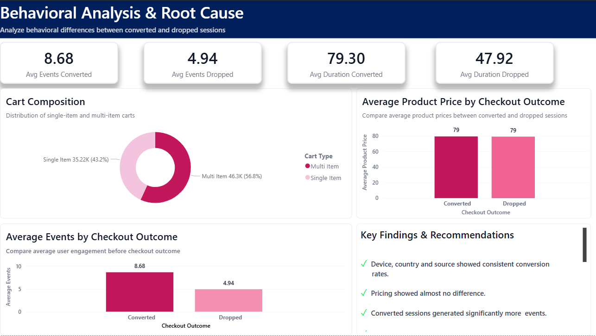

#  E-Commerce Funnel Analysis & Root Cause Investigation

##  Overview

This project analyzes user behavior across the e-commerce purchase funnel to identify conversion drop-offs, validate potential causes, and recommend data-driven business actions.

The analysis combines SQL-based funnel investigation with an interactive Power BI dashboard to move beyond identifying *where* users drop off and uncover *why* the drop occurs.

---

##  Business Objective

Identify the largest conversion leakage in the customer journey and determine whether the drop-off is caused by:

* Pricing
* Device or country-specific issues
* Traffic source quality
* Checkout friction
* User behavior and purchase intent

---

##  Dataset Overview

The analysis uses six e-commerce tables:

| Table       | Records |
| ----------- | ------- |
| Sessions    | XX,XXX  |
| Events      | XXX,XXX |
| Orders      | XX,XXX  |
| Order Items | XX,XXX  |
| Customers   | XX,XXX  |
| Products    | X,XXX   |

**Total Records:** XXX,XXX+

> Replace the values above with the actual row counts from your dataset.

---

##  Data Model

The project uses:

* Sessions
* Events
* Orders
* Order Items
* Customers
* Products

Custom SQL views were created for session-level funnel and behavioral analysis:

* `session_funnel_base`
* `session_behavior_base`

---

##  Key Business Metrics

* Total Revenue: **$3.66M**
* Total Orders: **27K**
* Total Customers: **20K**
* Average Order Value: **$133.58**
* Overall Conversion Rate: **27.98%**

---

##  Funnel Analysis

### Funnel Stages

1. Page View
2. Add To Cart
3. Checkout
4. Purchase

### Results

| Stage Transition    | Conversion Rate |
| ------------------- | --------------- |
| View → Cart         | 67.93%          |
| Cart → Checkout     | 55.09%          |
| Checkout → Purchase | 74.77%          |

### Key Insight

The largest funnel leakage occurs between:

**Add-To-Cart → Checkout (~45% Drop-Off)**

---

##  Root Cause Investigation

### 1. Segmentation Analysis

Conversion rates were analyzed across:

* Country
* Device
* Traffic Source
* Country × Device × Source combinations

#### Result

Conversion remained consistently around **55%** across all segments.

**Conclusion:** No country, device, or source-specific issue was identified.

---

### 2. Pricing Analysis

Average product prices were compared between:

* Converted sessions
* Dropped sessions

#### Result

Pricing remained nearly identical across both groups.

**Conclusion:** Pricing is not responsible for the checkout drop.

---

### 3. Behavioral Analysis

User engagement metrics were compared.

| Metric                     | Converted | Dropped |
| -------------------------- | --------- | ------- |
| Avg Events                 | 8.68      | 4.94    |
| Avg Session Duration (Min) | 79.30     | 47.92   |

#### Result

Converted sessions showed significantly higher engagement.

**Conclusion:** Users who complete checkout interact more with the platform and spend more time evaluating products.

---

### 4. Cart Behavior Analysis

* Multi-item carts were more common than single-item carts.
* Users often added products without completing checkout.

#### Conclusion

The cart is frequently used as a temporary wishlist or comparison tool rather than a purchase commitment mechanism.

---

##  Final Conclusion

The Cart → Checkout drop-off is **not driven by pricing, geography, device, traffic source, or checkout friction.**

Behavioral indicators show:

* Lower engagement
* Shorter session duration
* Delayed decision-making

The primary driver of the drop appears to be:

### Low Purchase Intent

Users frequently add products to the cart without a strong intention to complete the purchase.

---

##  Business Recommendations

* Add low-stock alerts and urgency messaging
* Introduce limited-time promotions
* Implement cart abandonment email campaigns
* Provide free-shipping thresholds
* Display trust signals (reviews, guarantees, secure checkout)
* Simplify the checkout experience

---

## Power BI Dashboard

The project includes a 4-page interactive dashboard:

### Page 1 — Executive Summary

* Revenue KPIs
* Orders & Customer Metrics
* Revenue Trends
* Revenue by Device & Country

### Page 2 — Funnel Analysis

* Conversion Funnel
* Funnel Stage Metrics
* Conversion Performance

### Page 3 — Segmentation Validation

* Country Analysis
* Device Analysis
* Source Analysis
* Multi-Dimensional Validation

### Page 4 — Root Cause Analysis

* Engagement Comparison
* Session Duration Analysis
* Pricing Analysis
* Root Cause & Recommendations

---

## 📸 Dashboard Screenshots

Add screenshots here:

### Executive Summary



### Funnel Analysis



### Segmentation Analysis



### Root Cause Analysis



---

## Tech Stack

### SQL

* CTEs
* Aggregations
* Joins
* Views
* Funnel Analysis
* Behavioral Analysis

### Power BI

* Data Modeling
* DAX Measures
* KPI Design
* Interactive Filtering
* Dashboard Development
* Storytelling & Visualization

---

##  Project Structure


Ecommerce-Funnel-Analysis/

│
├── data/
│
├── sql/
│   ├── basic_funnel.sql
│   ├── checkout_analysis.sql
│   ├── root_cause.sql
│
├── views/
│   ├── 01_create_view.sql
│
├── dashboard/
│   └── Ecommerce_Funnel_Dashboard.pbix
│
├── images/
│   ├── page1.png
│   ├── page2.png
│   ├── page3.png
│   └── page4.png
│
└── README.md
```


